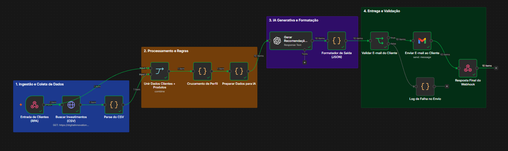
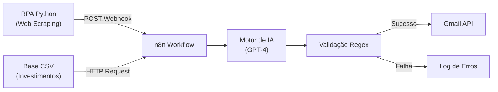

# 🚀 Assistente de Investimentos com RPA e IA Generativa

Pipeline de automação inteligente que realiza a extração de dados de clientes simulando RPA em Python, processa regras de negócio no **n8n**, gera recomendações personalizadas através de **IA Generativa (LLM)** e realiza o envio automático por e-mail com validação de dados.

> **Créditos:** Projeto desenvolvido como desafio prático do bootcamp da **[Digital Innovation One (DIO)](https://www.dio.me/)**.

---

## 📸 Demonstração do Workflow (n8n)



---

## 🛠️ Tecnologias e Ferramentas

| Etapa | Ferramenta | Função |
|---|---|---|
| **Hospedagem** | GitHub Pages | Disponibiliza a página de clientes e a base CSV de investimentos |
| **Extração (RPA)** | Python + BeautifulSoup | Realiza web scraping dos dados dos clientes via Google Colab |
| **Orquestração** | n8n Cloud | Validação de dados, cruzamento de perfis e roteamento de falhas |
| **IA Generativa** | OpenAI (GPT-4) / n8n Gateway | Geração de e-mails dinâmicos e personalizados por perfil |
| **Entrega** | Gmail API | Disparo automático das recomendações de investimento |

---

## ⚙️ Arquitetura da Solução



## 🎯 Entregáveis do Desafio

- Repositório forkado e estruturado;
- Script RPA em Python integrado ao Webhook do n8n (src/extrair_clientes.ipynb);
- Workflow completo exportado (n8n/workflow.json);
- Integração com IA Generativa para mensagens dinâmicas (Desafio Completo);
- Sistema de fallback e logs de falha no envio de e-mails.

## 📁 Estrutura do Repositório

```

├── n8n/
│   └── workflow.json          # Workflow exportado do n8n
├── src/
│   └── extrair_clientes.ipynb # Notebook Python (RPA)
├── docs/
│   ├── index.html             # Tabela simulada de clientes
│   └── data.csv               # Base de dados de investimentos
└── README.md

```